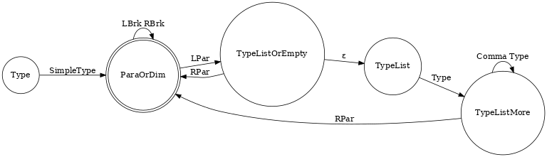
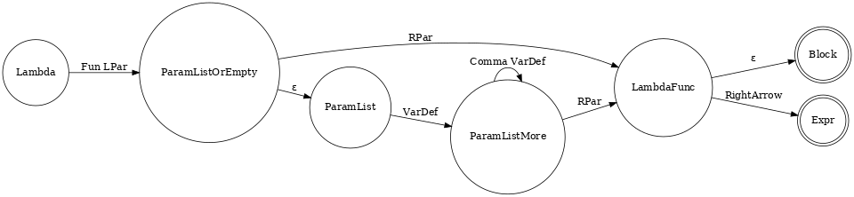
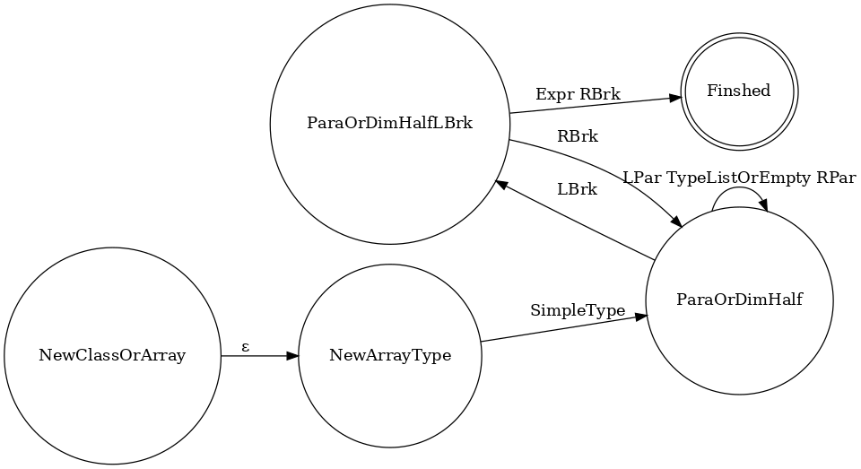

# PA1-B 实验报告

### 任务一：LL(1) 语法分析

「抽象类」和「局部类型推断」这两部分修改成 LL(1) 文法并不是什么难事，主要是「First-class Functions」比较难。

#### 新的函数类型

新增了以下规则：

```
- Type -> SimpleType ArrayDim
- ArrayDim -> LBrk RBrk ArrayDim
- ArrayDim ->

+ Type -> SimpleType ParaOrDim
+ ParaOrDim -> LPar TypeListOrEmpty RPar ParaOrDim
+ ParaOrDim -> LBrk RBrk ParaOrDim
+ ParaOrDim ->
+ TypeListOrEmpty -> TypeList
+ TypeListOrEmpty ->
+ TypeList -> Type TypeListMore
+ TypeListMore -> Comma Type TypeListMore
+ TypeListMore ->
```

简单来说就是 Type 开头为 SimpleType，再加上交替而接的 Parameter 和 ArrayDim。



#### Lambda 表达式

新增了以下规则：

```
+ Expr -> Lambda
+ Lambda -> Fun LPar ParamListOrEmpty RPar LambdaFunc
+ LambdaFunc -> RightArrow Expr
+ LambdaFunc -> Block
```

这里处理了左公因子，将 Block Lambda 和 Expression Lambda 公共的部分提取出来独立成一个符号。

```
+ ParamListOrEmpty -> ParamList
+ ParamListOrEmpty ->
+ ParamList -> VarDef ParamListMore
+ ParamListMore -> Comma VarDef ParamListMore
+ ParamListMore -> 
```

这里处理了左递归，先判断是否为空，再依次添加。



#### 函数调用

这里我是修改了 IdOrCall，将其分裂成 Id 和 Call 两个分别处理即可。

```
- Term8 -> Dot Id IdOrCall Term8
- IdOrCall -> LPar ExprListOrEmpty RPar
- IdOrCall ->
- Expr9 -> Id IdOrCall

+ Term8 -> Dot Id Term8
+ Term8 -> LPar ExprListOrEmpty RPar Term8
+ Expr9 -> Id
```

#### 其他

发现 new 的语法在添加了 Lambda 表达式之后也需要进行一些改变。

```
- NewClassOrArray -> SimpleType LBrk NewArrayRem
- NewArrayRem -> RBrk LBrk NewArrayRem
- NewArrayRem -> Expr RBrk

+ NewClassOrArray -> NewArrayType Expr RBrk
+ NewArrayType -> SimpleType ParaOrDimHalf
+ ParaOrDimHalf -> LPar TypeListOrEmpty RPar ParaOrDimHalf
+ ParaOrDimHalf -> LBrk ParaOrDimHalfLBrk
+ ParaOrDimHalfLBrk -> RBrk ParaOrDimHalf
+ ParaOrDimHalfLBrk ->
```



### 任务二：错误恢复

这部分比较简单，直接按照实验指导书上所表述的规则编写即可。

```rust
// unimplemented!()
loop {
let ret = {
    if let Some(x) = table.get(&(lookahead.ty as u32)) { x } else {
    if end.contains(&(lookahead.ty as u32)) { return StackItem::_Fail; } else { 
        *lookahead = lexer.next(); 
        continue;
    }
    }
};
break ret
}
```

### 思考题

**Q1：本阶段框架是如何解决空悬 else (dangling-else) 问题的？**

LL(1) 文法无法解决 dangling-else 问题。二义性文法的处理通常需要额外的消除二义性规则，故 LL(1) 文法无法处理，shift-reduce 可以。

**Q2：使用 LL(1) 文法如何描述二元运算符的优先级与结合性？请结合框架中的文法，举例说明。**

首先将操作符按优先级划分符号：`OpX -> ???` ，然后将 Expr 也按优先级划分：

```
Expr5 -> Expr6 Term5
Term5 -> Op5 Expr6 Term5
Term5 ->
```

Expr5 的操作数两边只能为 Expr6，这样便保证了优先级；Term5 的右递归性则实现了右结合性，并且在代码内对 Vec 进行 reverse 从而将右结合性转化为左结合性。 

**Q3：无论何种错误恢复方法，都无法完全避免误报的问题。 请举出一个具体的 Decaf 程序（显然它要有语法错误），用你实现的错误恢复算法进行语法分析时会带来误报。 并说明该算法为什么无法避免这种误报。**

例如：

```c++
class Main {
    static void main() {
        int x = 3 * f[5];
        int x = 3 * [5];
    }
}
```

第 4 行的代码中的错误明显是少写了变量名，但是 decaf 在 (4,21) 和 (4,23) 两个位置都报了两个错误。

分析可知：当 parser 分析到 LBrk 时，触发错误修正部分的代码，会先忽略掉 LBrk 读取下一个，此时在 parser 看来代码可以理解为是 `int x = 3 * 5]`，接着分析到 RBrk 时会再次报错。

该算法无法避免误报的原因是算法可以做到忽略额外的部分并跳过，但无法猜测缺失的部分的位置及其类型，从而对一些因为漏写代码而产生的 Bug 无法做到准确判断。