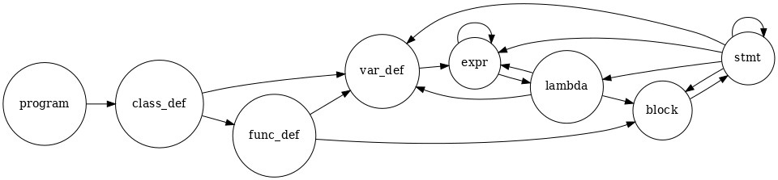
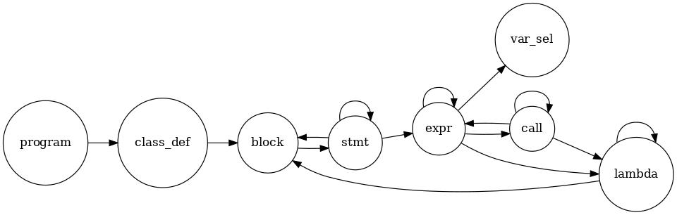

# PA2 实验报告

### 合并前一阶段的工作

由于之前是在总框架上实现的 PA1-A，合并工作变成了打个补丁就完事的简单操作。合并途中遇到很多需要手动处理的 conflicts，这是因为之前 PA1-A 修改了某些 AST 节点的变量类型所导致。

### 新特性 1：抽象类

需要判断非抽象类是否重写了所有的抽象成员。

编写了一个 `fn ab_unoverload(&self) -> Vec<(&'a str, Ty<'a>)> `，返回当前函数未被重载的抽象函数，只需要递归调用即可。

注意 Decaf 不允许出现重名的函数，哪怕参数类型不一致也不行。

### 新特性 2：局部类型推导

需要在 `type_pass.rs` 增加对 Var 的类型推导

### 新特性 3：First-class Functions

为了输出 Lambda 的表达式作用域，`scope.rs` 不单单增加了 Lambda 的模块，还需要増加 Expr 的模块，否则有些 Lambda 的作用域不会被递归到。

Symbol 増加了 Lambda 类。

ScopeOwner 增加了 Lambda 和 LambdaExpr 类（LambdaExpr 用来处理 expression lambda）。

TyKind 增加了 Lambda(&'a [Ty<'a>]) 类。原本我想尝试着让 Lambda 使用 TyKind::Func，但后来发现在某些需要区分 lambda 表达式和函数的情况下，只用 TyKind::Func 是无法区分的，故增加了一种 TyKind。

SymbolPass 增加了一些变量：

- cur_idx：当递归栈包含 StmtKind::IndexSel 时置为 true；
- cur_lambda：用来判断当前是否处于 Lambda 的作用范围内；
- cur_assign：当递归栈包含 StmtKind::Assign 和 StmtKind::LocalVarDef 时置为 true；
- cur_def：记录了当前所有正在被定义的变量的 Loc。

其中 cur_idx，cur_assign 和 cur_used 一起实现了「不能对捕获的外层的非类作用域中的符号直接赋值，但如果传入的是一个对象或数组的引用，可以通过该引用修改类的成员或数组元素。」，cur_def 实现了「如果要将 Lambda 表达式赋值给一个正在定义的符号，则 Lambda 内部作用域中的变量既不能与该符号重名，也不能访问到该符号。」

SymbolPass 增加了处理 lambda 和 expr 的递归函数，同时完善了 stmt。

TypePass 主要集中在对返回类型的处理。实现时，Block 和 Stmt 均需要返回一个 `(bool, Ty<'a>)`，前者记录是否所有情况都会有 return，后者记录 return 值。函数 `combine` 实现了求解两变量类型的上界。

### 思考题

**Q1：实验框架中是如何实现根据符号名在作用域中查找该符号的？在符号定义和符号引用时的查找有何不同？**

维护一个作用域栈，自顶向底在每个作用域查找符号。

符号定义阶段时，因为是从前往后处理的代码，定义的符号肯定是第一次出现的，故查找时不用指定位置；符号引用阶段时，需要指定位置，以免引用到在当前位置之后定义的符号。

**Q2：对 AST 的两趟遍历分别做了什么事？分别确定了哪些节点的类型？**

第一遍遍历 SymbolPass 确定了类、函数参数、lambda 参数和 block 的作用域以及每个作用域内的变量名称（即符号），同时检查和定义、引用、owner 等有关的语法错误，确立了 Func 及其参数和部分 Var 节点的类型。

第二遍遍历 TypePass 进行了变量类型的推导，确定了每个变量的类型，同时检查和类型、返回值等有关的语法错误，确立了 Var、Block、Stmt、Expr、Lambda 等在第一遍遍历后未能确立类型的节点的类型。

**Q3：在遍历 AST 时，是如何实现对不同类型的 AST 节点分发相应的处理函数的？请简要分析。**

SymbolPass 函数转移图：

TypePass 函数转移图：

对于每种函数，其参数都对应一种 AST 节点类型。

对于 Stmt、Expr 和 Call 这种包含众多情况的 AST 节点，需要使用 match 分开处理每种不同的情况，编写不同的分发处理函数的代码逻辑。

在两次遍历中，并不是每个 AST 节点都有对应的处理函数，这和每次遍历所要完成的功能有关。例如 TypePass 中，FuncDef 在 `class_def` 的处理函数内就已经被展开了，并没有对应的处理函数。

