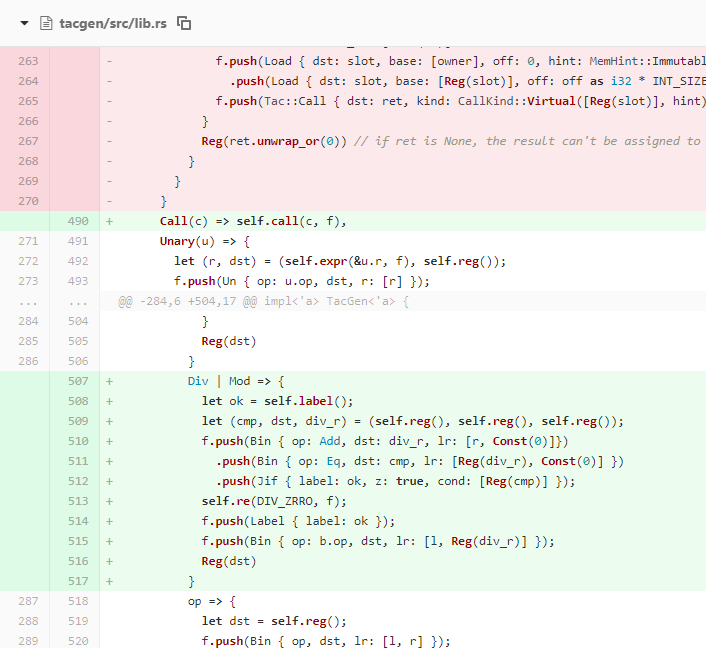
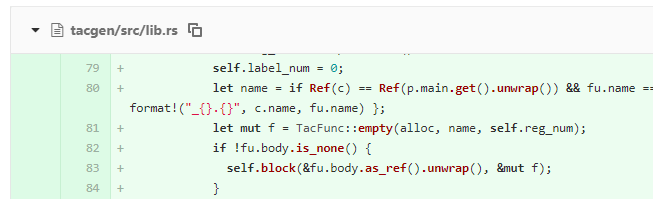
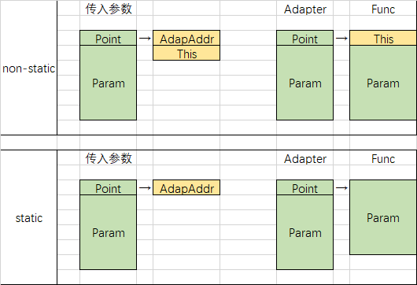
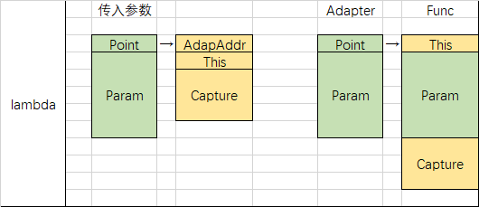
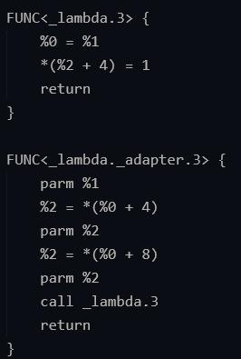

# PA3 实验报告

### 新特性 0：动态错误检查

利用条件跳转指令，判断除数是否为 0，若非 0 则跳过报错指令。

### 新特性 1：抽象类

在遍历抽象函数的函数体时判断函数体是否为空。具体见图内 Line 82~84。

### 新特性 2：局部类型推导

需要在 `type_pass.rs` 增加对 Var 的类型推导

### 新特性 3：First-class Functions

##### 扩展 call

为了实现扩展 call，我把 expr 中的 call 部分独立成一个函数来处理。整体上大概分成几种情况：

- `A.a()` 或 `a()`，其中 a 是 function；
- `A.a()` 或 `a()`，其中 a 是 variate；
- `{}()`，其中 `{}` 是 call, lambda, indexsel。

##### 将方法名直接当做函数使用

为了实现此功能，我给每个函数都新建了对应的 Adapter 函数。调用原函数的过程为：先调用 Adapter 函数，Adapter 函数再调用原函数。

如图，左边为 non-static 的处理方式，右边为 static 的处理方式。non-static 时 adapter 获得了一系列参数（左上绿色）然后将其处理成左下并重新将参数传入，最后调用原函数。static 区别在于 adapter 不会将 this 传参。

建立 adapter 的好处是当方法名被当做函数使用时，我们很难得知其是 static 还是 non-static，此时我们可以按照 non-static 的方式调用 adapter，由不同的 adapter 去判断需不需要处理 this。

##### Lambda表达式

Lambda 捕获变量需要在 PA2 的基础上在进行修改。

维护一个队列，每当调用变量或者函数时对其进行记录并加到队列尾部，调用 lambda 时记录下队列一开始的长度，结束时再记录下队列现在的长度，两者间隔中的变量经过去重（建 一个 HashSet 按照 Loc 去重）和排除自身参数和局部变量后剩余的就是当前 lambda 所需要捕获的变量。

每一个 lambda 和普通函数一样，都需要新建一个函数和一个 adapter。如下图：

This 为可选内容。

为了尽可能减少修改，在处理 lambda 的时候我并没有将 `TacProgram` 传入递归，而是新建了一个 Vec 用来搜集 lambda 所建立的 `TacFunc`，并在分析完后再将其 push 到 `TacProgram` 内。 

对于 Varsel，我新建了一个名为 cap_info 的专门针对捕获变量的 HashMap，对于每个 Var 我会让其先去 cap_info 内查询以确定其是否为被捕获的变量，找不到则再去查询 var_info 和 func_info。

### 实现工程中遇到的困难

这次遇到的困难之一在于这次实验只提供了 result 而没有提供 tac，更难通过拟合测试数据的方式来修改代码，有一大部分时间我都是在思考每个测试样例正确的 tac 应该怎么写。

我还错误理解了捕获变量的一些细节，例如在捕获 this 中的 field 时，我原先是以为需要捕获 this 和其 field，最后在陈嘉杰同学的点拨下才发现此错误。

同时我还发现 tacvm 有一个 bug。

如图 tac 代码，在调用  `_lambda.3` 之前传入了 3 个参数，但是 tacvm 却错误地认为 `_lambda.3` 参数数量为 2，发出 TooMuchArgs 错误。

最后在和陈嘉杰同学的交流下我们发现了 tacvm 的 bug 并提交了 pull request.

